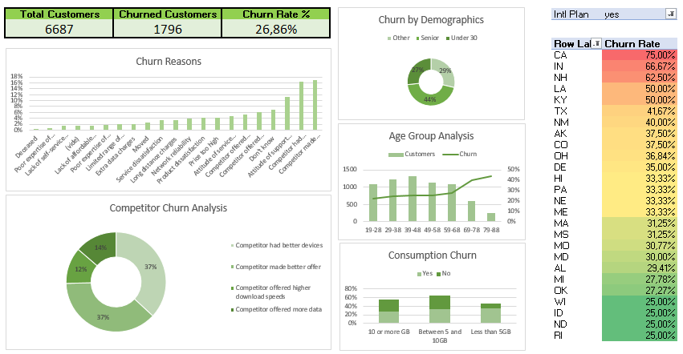

# Customer-churn-excel-case-study
Excel project analyzing churn data of a telecom company using pivot tables and dashboards.
# 📊 Customer Churn Analysis (Excel Case Study)

## 🔎 Project Overview
This project analyzes customer churn for **Databel**, a fictitious telecom company.  
Using Excel, I explored customer demographics, usage patterns, and subscription details to uncover insights about churn behavior.  

The dataset includes **6,687 customers**, of which **1,796 churned**, resulting in an overall churn rate of **26.8%**.  
The analysis highlights key factors contributing to churn and provides recommendations for retention strategies.  

---

## 🛠️ Tools & Techniques
- Microsoft Excel 2019
- Pivot Tables & Pivot Charts
- Conditional Formatting
- Aggregated summaries & dashboards

---

## 📂 Repository Contents
- **`Analyzing Customer Churn.xlsx`** → Main Excel file containing:
  - **Overview** → High-level churn KPIs  
  - **Databel - Aggregate** → Aggregated customer dataset with demographics & subscription details  
  - **Churn Analysis** → Pivot analysis by customer segments (e.g., seniors, under 30, others)  
  - **Databel - Customer** → Raw dataset with 30+ variables (calls, plans, charges, churn labels, etc.)  
  - **Customer Pivots** → Pivot table summaries of churn metrics  

---

## 📈 Key Insights
- **Churn Rate**: 26.8% of customers left the service.  
- **Age Factor**: Senior customers showed the highest churn (38%), while customers under 30 had the lowest (~23%).  
- **Service Plans**: Customers with international plans or higher customer service calls were more likely to churn.  
- **Usage & Billing**: Higher monthly charges and low engagement with add-on services correlated with churn.  

---

## 🚀 How to Use
1. Download `Analyzing Customer Churn.xlsx` from this repository.  
2. Open in Excel.  
3. Explore:
   - **Overview sheet** for top KPIs.  
   - **Customer Pivots sheet** for churn summaries.  
   - **Churn Analysis sheet** for demographic breakdowns.  

---

## 💡 Recommendations
- Target **senior customers** with loyalty programs to reduce churn.  
- Provide better **customer service training** to minimize complaints.  
- Offer **customized bundles** for customers with international usage.  
- Introduce discounts or perks for customers with long tenure.  

---

## 📷 Dashboard Preview 

